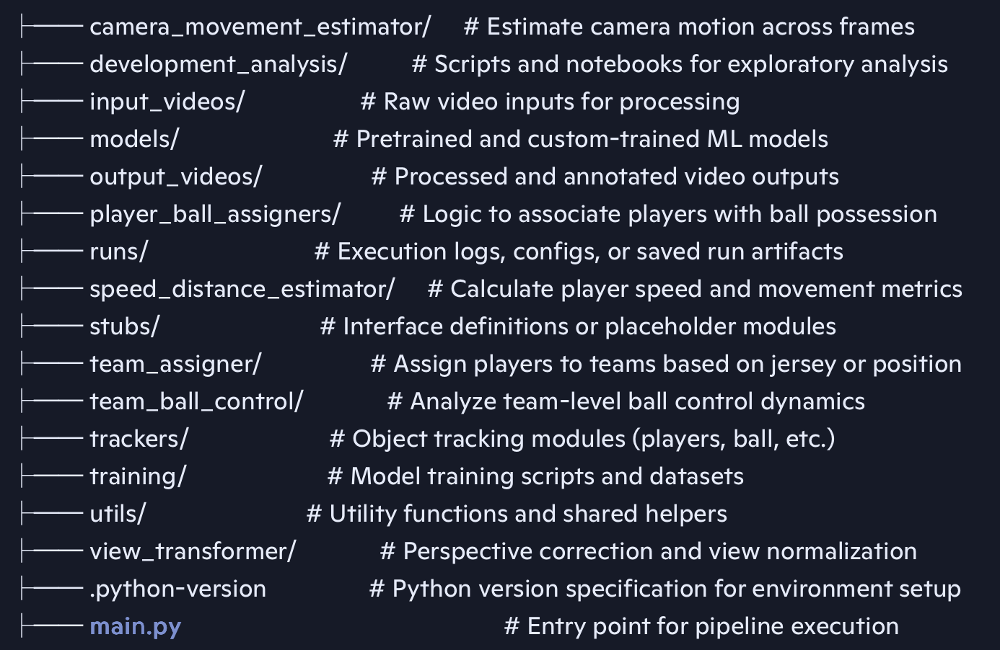
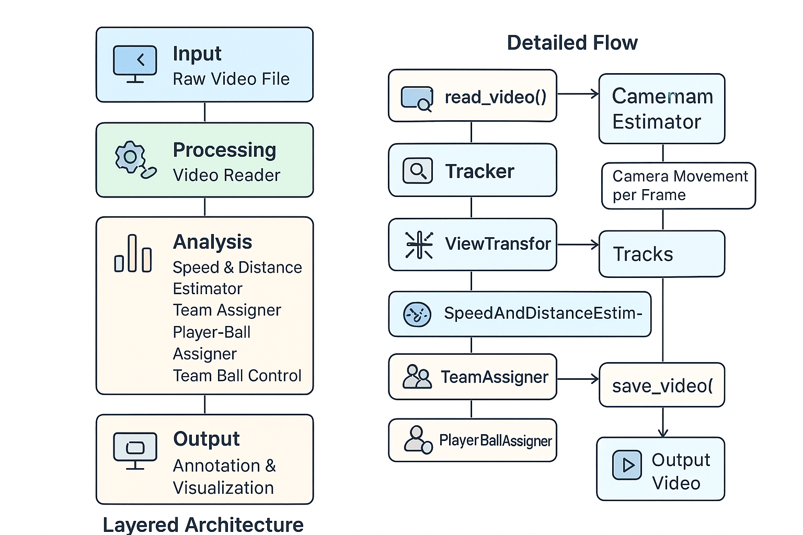

# ⚽ Football Player & Object Tracking with YOLO

## 📌 Introduction
This project focuses on **detecting, tracking, and analyzing** players, referees, and footballs in match footage using **YOLO**, one of the most powerful real-time object detection models available. This project is very large so multiple branches are created to help you better understand the technique and features that is being developed. Since training a **YOlO** model requires computational resources on this project, the intial training is done with **google colab** with a TPU resource to create the best model. After the best model is trained, you will need to download the best model to your local environment.

💡 Tip: Before starting this project you will need to create a Kaggle account, and Roboflow account. The links are provided in the resource section below?

### 🎯 Key Objectives
- **Object Detection & Tracking**  
  Identify and track players, referees, and footballs across video frames using YOLO, with custom training to enhance accuracy.
  
- **Team Classification via Color Clustering**  
  Assign players to teams by analyzing jersey colors through **K-Means pixel segmentation and clustering**.

- **Ball Possession Analysis**  
  Calculate each team’s **ball acquisition percentage** during a match.

- **Camera Motion Compensation**  
  Apply **optical flow** to detect and adjust for camera movement between frames, ensuring accurate player movement tracking.

- **Perspective Transformation**  
  Convert pixel-based positions into **real-world measurements (meters)** by modeling scene depth and perspective.

- **Performance Metrics**  
  Compute each player’s **distance covered** and **speed** throughout the match.

---

## 🛠️ Tech Stack
- **Programming Language:** Python 3.x
- **Core Libraries:** OpenCV, NumPy, Pandas, Matplotlib,Ultralytics, Supervision
- **ML/DL Frameworks:** PyTorch / TensorFlow (YOLO implementation)
- **Clustering:** scikit-learn (K-Means)
- **Tracking:** Optical Flow (Lucas-Kanade / Farneback)
- **Visualization:** Matplotlib, Seaborn

---

## Reesources
- [Video resource](https://drive.google.com/file/d/1httquBFSJ-B58DQG5SZ1kgUQP7XEf1Sr/view?usp=sharing)
- [Video After Completing Project](https://drive.google.com/file/d/16akHpzVdFvSikzmS7Y3IAb63dJXPYM03/view?usp=sharing)
- [Kaggle](https://www.kaggle.com)
- [RoboFlow](https://https://roboflow.com)
- [Ultralytics](https://docs.ultralytics.com)

# How to download your data from Roboflow into Google Colab
1. You need to create a notebook in colab
2. Go to Roboflow and create an account.
3. Search for the dataset your going to train your model, click on it
4. A modal will appear presenting various export formats compatible with different computer vision task and tools YOLO, Pascal VOC, COCO
5. Select the YOLO5 format
6. Select **Show download code** This option provides code snippets (e.g., Python, curl) for programmatic download. While useful for integrating with notebooks or scripts, it involves using code
7. The steps are very similar to this video [Example Video](https://www.youtube.com/watch?v=76E6esnez8E&t=1s)

## 📁 Project Structure

This repository is organized to support modular development of a sports analytics or computer vision pipeline. Below is an overview of the key components:

--- 
💡 Architectual Diagram - High Level Overview

